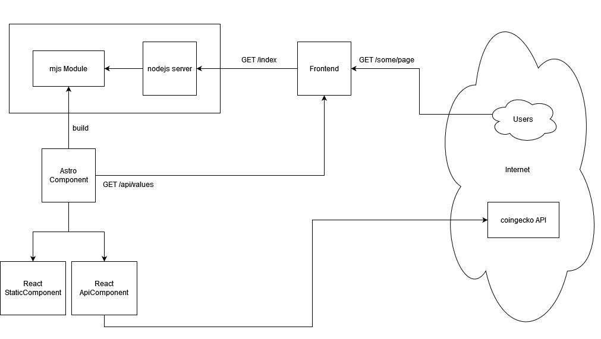

# Demo using Astro with ASP.NET server

## High level scheme



## Run
### Run Astro server
In `Astro.Components` run
```shell
yarn
yarn run build
node dist/server/entry.mjs
```

Copy build files from `Astro.Components/dist/client` to `Astro/wwwroot/astro`

### Run ASP.NET server
Start the server on port 5000